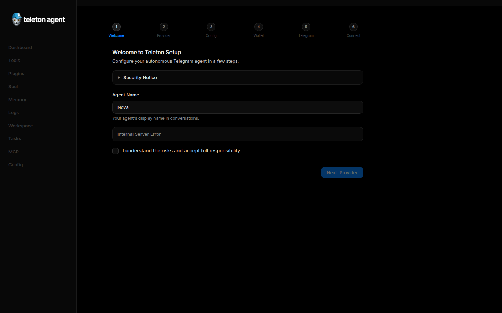
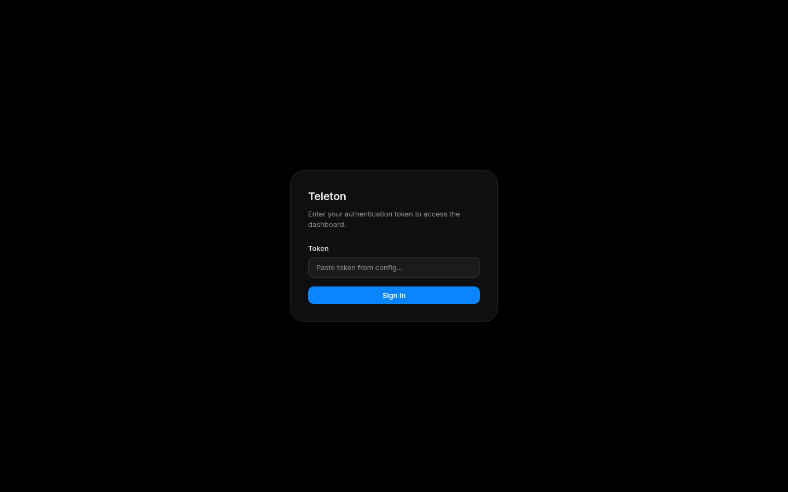

# Быстрый старт

Teleton Agent — это автономный агент для Telegram и TON. WebUI — это пульт оператора: вы завершаете первичную настройку, входите по токену и дальше управляете всем (агентами, инструментами, промптами, автономными задачами, безопасностью, аналитикой), не открывая руками ни одного файла конфигурации.

Этот раздел читают первым после установки. Здесь объясняется, что нужно подготовить, как работает мастер настройки, как войти в систему и как запустить первую задачу.

## Что подготовить заранее

Понадобится:

- **Node.js 20** или новее.
- Рабочий **ключ LLM-провайдера** (Anthropic, OpenAI, Groq и т. д.), если вы не используете провайдер без ключа: Claude Code, Cocoon или локальный сервер.
- **Аккаунт Telegram или токен бота**, который вы готовы автоматизировать. Не подключайте свой основной личный аккаунт, если не готовы к тому, что агент будет читать диалоги и отправлять сообщения от вашего имени.
- Ваш числовой **идентификатор пользователя в Telegram** — он станет первым admin ID.
- Для режима личного аккаунта: **API ID и API hash** с <https://my.telegram.org/apps>.

> ⚠️ **Важно.** Когда нужные инструменты включены, агент может читать диалоги, отправлять сообщения, переводить TON и выполнять команды оболочки. Относитесь к WebUI как к административной консоли: держите его на `localhost`, защищайте токен входа и пересмотрите политики в [Центре безопасности (Security Center)](08-security.md), прежде чем включать что-то опасное.

## Установка

Большинству операторов хватает официального CLI:

```bash
npm install -g teleton@latest
teleton setup --ui
```

Для разработки из исходников:

```bash
git clone https://github.com/TONresistor/teleton-agent.git
cd teleton-agent
npm install
npm run build
npm run dev:cli -- setup --ui
```

Команда `setup --ui` поднимает временный локальный сервер и печатает одноразовую ссылку. Откройте её в браузере — в адресе зашит короткоживущий nonce, который аутентифицирует вас на время прохождения мастера.

## Мастер первичной настройки



В верхней части мастера видно шесть пронумерованных шагов плюс финальный экран подтверждения:

1. **Welcome.** Прочтите *Security Notice* (раскрывающийся блок), укажите отображаемое имя агента (по умолчанию `Nova`) и поставьте галочку **I understand the risks and accept full responsibility**. Кнопка «Next» неактивна, пока галочка не установлена.
2. **Provider.** Выберите LLM-провайдера и модель. В карточках доступны Anthropic, OpenAI, Groq, Claude Code, Cocoon, локальные сервера, совместимые с OpenAI, и другие. Если провайдер требует ключ, вставьте его — мастер проверит ключ перед тем, как пустить дальше.
3. **Config.** Введите или подтвердите имя агента, модель по умолчанию и ваш числовой Telegram user ID (он становится первой записью в `telegram.admin_ids`). На этом же шаге можно включить сам WebUI.
4. **Wallet.** Сгенерируйте новый TON-кошелёк, импортируйте мнемонику или пропустите шаг. При генерации мастер потребует подтвердить мнемонику на следующем подэкране.
5. **Telegram.** Выберите режим: личный аккаунт (API ID + API hash + телефон) или бот (bot token). Для личного режима выберите способ входа — **QR code** или **Phone code**. QR-код обновляется автоматически. Если ваша сеть блокирует CDN Telegram, переключитесь на телефонный код или настройте MTProto-прокси.
6. **Connect.** Мастер выполняет тестовое подключение к Telegram и LLM-провайдеру. Проверку можно пропустить, но тогда возможные проблемы придётся чинить вручную в разделе [Настройки (Configuration)](11-settings.md).

Когда все шаги пройдены, появляется карточка **Setup Complete** с «сырым» токеном входа в WebUI. **Скопируйте этот токен немедленно** — он показывается ровно один раз и нужен для входа. В `config.yaml` сохраняется только его хеш.

## Первый вход



После настройки запустите агента в режиме WebUI:

```bash
teleton start --webui
```

В терминале появится локальный адрес (по умолчанию `http://127.0.0.1:8080`). Откройте его в браузере. Появится карточка **Teleton** с единственным полем *Paste token from config…* и кнопкой **Sign In**. Вставьте токен и нажмите Enter (или кнопку **Sign In**).

Если вы воспользовались стартовой ссылкой из терминала, токен передастся автоматически через фрагмент URL — поле ввода в этом случае пропускается.

## Обзор бокового меню

После входа интерфейс делится на части:

- **Верх бокового меню** — поле поиска (`Ctrl+K` / `Cmd+K`) и 22 ссылки на страницы.
- **Низ бокового меню** — переключатель агентов, кнопки управления агентом (start / stop / restart), переключатель темы (Dark ↔ Light), кнопка Logout и номер сборки.
- **Основная область** — выбранная страница.

Список из 22 страниц в порядке отображения: Dashboard, Agents, Tools, Plugins, Soul, Memory, Workspace, Tasks, Workflows, Pipelines, Events, MCP, Integrations, Network, Hooks, Sessions, Analytics, Feedback, Security, Self-Improve, Autonomous, Configuration. Каждой посвящена отдельная глава руководства.

**Командная палитра (Command Palette, `Ctrl+K`)** позволяет переходить на любую страницу и запускать вспомогательные команды (например, *Generate Widget*) без использования мыши.

## Первая автономная задача

1. Откройте **Autonomous** в боковом меню.
2. Нажмите **+ New task**.
3. В поле естественного языка опишите цель простыми словами, например:

   ```text
   Monitor new DeDust pools every 5 minutes and report to @ton_ops
   when more than three pools appear.
   ```

4. Нажмите **Parse with AI**. Структурированные поля (goal, success criteria, failure conditions, allowed / restricted tools, strategy, priority, iteration limit, duration limit, budget) заполнятся автоматически вместе с показателем уверенности.
5. Внимательно проверьте каждое поле. Если уверенность ниже 70%, переформулируйте описание или заполните поля вручную. Особенно внимательно отнеситесь к **restricted tools** — высокорисковые инструменты `ton_send`, `jetton_send`, `exec_run` должны оставаться в ограниченном списке, если цель явно их не требует.
6. Нажмите **💾 Save & Start**. Задача проходит состояния `pending` → `queued` → `running`; в живом журнале событий появятся записи `plan`, `tool_call`, `tool_result`, `reflect`, `checkpoint`.

Полный жизненный цикл и правила pause/resume описаны в разделе [Автономный режим (Autonomous Mode)](03-autonomous-mode.md).

## Проверка после запуска

В первые десять минут после старта проверьте:

- **Dashboard** — провайдер, модель, аптайм, индикатор «agent ready» — все зелёные.
- **Sessions** — тестовое сообщение пришло, агент ответил корректно.
- **Tools** — включены только те инструменты, которые вы хотели разрешить, с правильным scope.
- **Security** — событие `agent_start` присутствует в журнале аудита, цепочка хешей валидна.

## Что делать, если что-то не работает

| Симптом | Что проверить в первую очередь |
| --- | --- |
| Экран входа не принимает токен. | Перезапустите агента и используйте стартовую ссылку из терминала — она обновляет nonce аутентификации. |
| Вход выполнен, но Dashboard показывает «Not connected». | Запустите runtime через кнопки управления агентом внизу бокового меню. |
| Автономные задачи зависли в `pending`. | Откройте Configuration → Telegram и убедитесь, что в `admin_ids` хотя бы один числовой ID. |
| Telegram сообщает «Auth failed». | Перепроверьте API ID и API hash, затем код страны в номере телефона, затем настройки MTProto-прокси. |
| Вызовы инструментов завершаются ошибкой «denied». | Откройте Tools и убедитесь, что инструмент включён и имеет правильный scope; сверьтесь с журналом валидации в [Центре безопасности (Security Center)](08-security.md). |

## Что читать дальше

- [Панель управления (Dashboard)](02-dashboard.md) — ежедневный обзор, виджеты, генератор виджетов.
- [Настройки (Configuration)](11-settings.md) — подробное описание каждой вкладки.
- [Центр безопасности (Security Center)](08-security.md) — политики, аудит, согласования.
